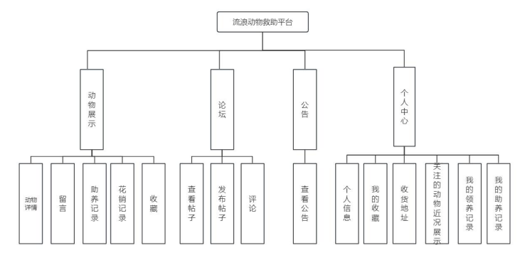
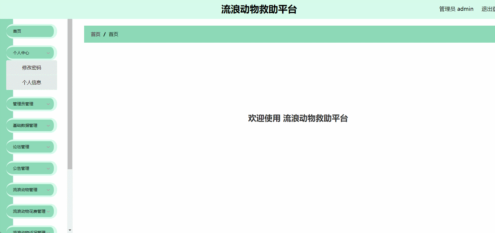

# liulangdongwujiuzhu🎂

基于SpringBoot+Vue的流浪动物救助平台

## 介绍🌞

> 该平台旨在为流浪动物救助站的管理人员提供一套高效、便捷的管理系统，让他们能够轻松地记录每一只动物的具体情况。通过这个平台，流浪动物们得以拥有自己的展示空间，无论是管理人员还是普通用户，都可以浏览到这些动物的详细信息。用户们不仅能够欣赏到这些可爱的动物，更有机会通过平台对心仪的动物进行领养或捐助，为它们提供一个温暖的家或必要的生存资源。此外，当动物不幸丢失时，平台还提供了寻宠请求发布功能，帮助失主尽快找回自己的宠物。同时，用户们还可以在论坛区域分享和交流关于动物的各类信息，如养护经验、救助故事等，增强社区互动。对于管理人员而言，该平台同样提供了丰富的管理功能。他们可以轻松管理用户信息，确保平台的安全与秩序；管理宠物信息，随时更新动物的状态；发布公告，向用户传达重要信息；对不当言论的帖子进行删除处理，维护良好的社区氛围；审核用户的领养请求，确保每一只动物都能得到合适的归宿。

## 软件架构🌞




## 项目演示🌞

> 管理端



> 普通用户


## 安装教程🌞

```
1. 运行环境准备mysql8 + java8 + node14.16.1

2. 配置maven路径，加载依赖

3. 运行sql文件，确保application.yml或config.properties的数据库名称和账号密码是数据库所在主机的账号密码
```

## 使用说明🌞

```
1. 登入
	管理员账号：admin	密码：123456

	客户账号：a1	密码：123456
  
2. 运行流程

SpringBoot+Vue项目的部署详情可以查看这篇CSDN博客：http://t.csdnimg.cn/kpuxS

前后端不分离项目的部署流程可以查看这篇CSDN博客：http://t.csdnimg.cn/CslA5
```

## CSDN项目合集🌞

点击前往：http://t.csdnimg.cn/Q4u84

# 联系我🌞

🐧：1902317191

we-chat：coding1902317191
